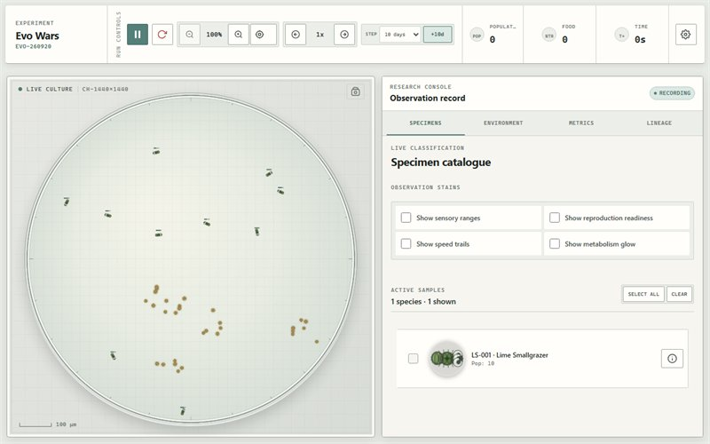
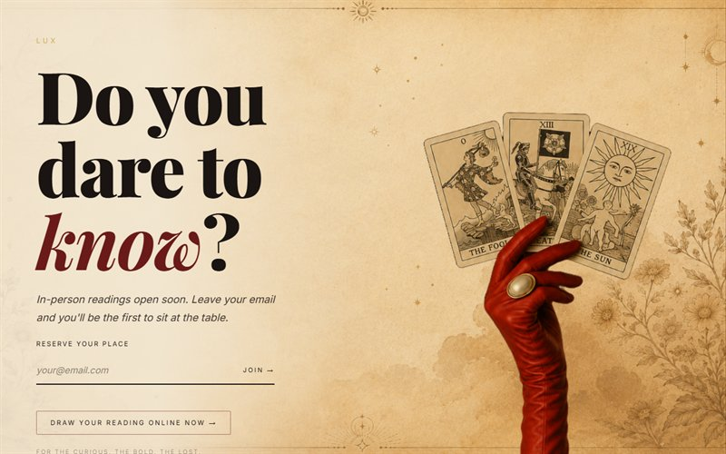
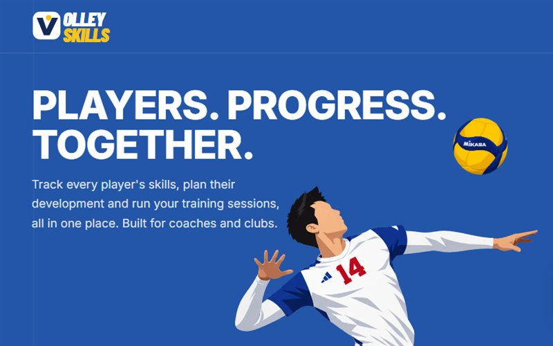
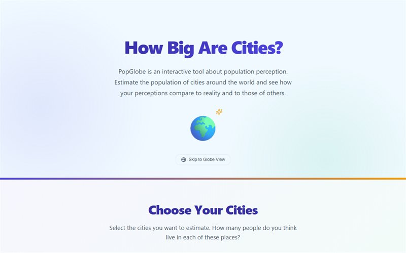

  <a href="https://www.albertovaldesrey.com/"><b>Website</b></a> &nbsp;·&nbsp;
  <a href="https://lu.linkedin.com/in/alberto-valdes-rey-b975a71b9"><b>LinkedIn</b></a> &nbsp;·&nbsp;
  <a href="https://ieeexplore.ieee.org/document/10405636"><b>IEEE Paper</b></a>

---

At ten I saw the film of Asimov's *Bicentennial Man* and decided I wanted to build machines that heal people from the inside. I took the long way round: biomedical engineering, then a thesis that wired people into VR headsets to read what their skin conductance said about how they felt.

Now I build medical software in Luxembourg by day. By night I simulate evolution, rain and fluid fields, mostly to watch them run. I'm the kind of person who will spend a weekend properly answering whether you get less wet if you run through the rain.

- 🔬 &nbsp;Published in IEEE: *Exploring Emotional Responses in Virtual Reality Through Skin Conductance Signal*
- 🌱 &nbsp;Currently building [`qrg-framework`](https://github.com/Ledsav/qrg-framework), a quantized relational grid: foundations, implementations, benchmarks
- ⚙️ &nbsp;I use daily: `.ts`, `.tsx`, `.py`, `.cs`, `.m`
- 💬 &nbsp;Ask me about signal processing, VR, generative simulation, or volleyball

---

<h3 align="center">Things I've built</h3>

<table>
<tr>
<td width="50%" valign="top">
  
  <h4>Evo Wars</h4>
  Organisms evolve by natural selection in real time. Genetic systems, DNA sequences, species forming and dying out on their own, under a virtual microscope.
    
  <a href="https://www.albertovaldesrey.com/evo-wars"><b>Live</b></a> &nbsp;·&nbsp; <a href="https://github.com/Ledsav/evo-wars">Code</a>
</td>
<td width="50%" valign="top">
  
  <h4>LUX</h4>
  An AI driven tarot reading. Vintage mysticism meets a modern conversational web app, built for the curious, the bold and the lost.
    
  <a href="https://www.albertovaldesrey.com/tarot-web/"><b>Live</b></a> &nbsp;·&nbsp; <a href="https://github.com/Ledsav/tarot-web">Code</a>
</td>
</tr>
<tr>
<td width="50%" valign="top">
  
  <h4>VolleySkills</h4>
  Season long skill tracking and training planning for volleyball coaches and clubs. Log every player's development in one place.
    
  <a href="https://volley.albertovaldesrey.com/"><b>Live</b></a> &nbsp;·&nbsp; <a href="https://github.com/Ledsav/volley-skills">Code</a>
</td>
<td width="50%" valign="top">
  
  <h4>PopGlobe</h4>
  Guess the population of cities around the world, then find out how far your instincts about global urbanisation really are from reality.
    
  <a href="https://popglobe.netlify.app/"><b>Live</b></a> &nbsp;·&nbsp; <a href="https://github.com/Ledsav/city-population">Code</a>
</td>
</tr>
</table>

<h4>Also worth a look</h4>

| Project | What it is |
| :--- | :--- |
| [**thesis-unity**](https://github.com/Ledsav/thesis-unity) | Emotional response in VR, read from skin conductance. The work behind the [IEEE paper](https://ieeexplore.ieee.org/document/10405636). |
| [**flow-field**](https://github.com/Ledsav/flow-field) | Fluid force fields you can push around with a cursor. |
| [**rain-simulation**](https://github.com/Ledsav/rain-simulation) | A directional rain exposure model. The running in rain question, settled. |
| [**bump-music**](https://www.albertovaldesrey.com/bump-music) | Tilt your phone and the accelerometer reshapes the track as it plays. |
| [**fit-snapshot**](https://github.com/Ledsav/fit-snapshot) | One framed photo a day, so change too slow to notice becomes obvious. |
| [**beatcut**](https://github.com/Ledsav/beatcut) | Slideshow videos cut to the beat, auto centred on the faces it detects. |
| [**ant-simulator**](https://github.com/Ledsav/ant-simulator) | Ant colony life and survival in Unity. Big behaviour from small rules. |

---

<picture>
  <source media="(prefers-color-scheme: dark)" srcset="https://raw.githubusercontent.com/Ledsav/Ledsav/output/github-contribution-grid-snake-dark.svg" />
  <source media="(prefers-color-scheme: light)" srcset="https://raw.githubusercontent.com/Ledsav/Ledsav/output/github-contribution-grid-snake.svg" />
  
</picture>

Full Stack Engineer at MDsim, Luxembourg. Also known to throw a themed house party.

