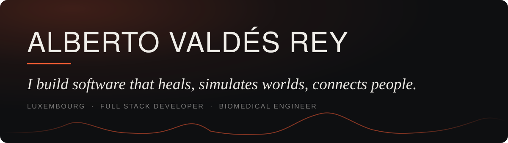

When I was ten I saw the film of Asimov's *Bicentennial Man* and decided I wanted to build the kind of machine that heals you from the inside. I took the long road there — biomedical engineering, then a thesis that wired people into VR headsets to find out what their skin conductance had to say about how they felt. These days I write software for medical teams in Luxembourg, and on evenings and weekends I simulate evolution, rain and fluid fields because I still want to know how things work.

The three things in that sentence up there are genuinely the three things I keep building. So that's how this is organised.

---

### Heals

> Signals from a body, turned into something a clinician or a person can act on.

- **[thesis-unity](https://github.com/Ledsav/thesis-unity)** — Emotional response in VR, measured through skin conductance. Published as *Exploring Emotional Responses in Virtual Reality Through Skin Conductance Signal* → **[read the paper (IEEE)](https://ieeexplore.ieee.org/document/10405636)**
- **[msc-thesis](https://github.com/Ledsav/msc-thesis)** — The MATLAB side of the same work: the signal processing pipeline behind the results.
- **[fit-snapshot](https://github.com/Ledsav/fit-snapshot)** — A daily, consistently framed progress photo, compared over weeks through sliders, side-by-side zoom and grids. Change you can't see day to day becomes obvious across months.

### Simulates worlds

> Systems I build mostly to watch them run.

- **[evo-wars](https://github.com/Ledsav/evo-wars)** · [**live**](https://www.albertovaldesrey.com/evo-wars) — Organisms evolve through natural selection in real time: genetic systems, DNA sequences, species forming and dying out on their own.
- **[flow-field](https://github.com/Ledsav/flow-field)** — Flow and force fields from fluid simulation, made visual, tactile and interactive. Complex physics you can push around with a cursor.
- **[rain-simulation](https://github.com/Ledsav/rain-simulation)** — An interactive demo of a directional rain exposure model. It answers, properly, whether you get less wet if you run.
- **[ant-simulator](https://github.com/Ledsav/ant-simulator)** — Ant colony life and survival, in Unity. Emergent behaviour from very small rules.
- **[qrg-framework](https://github.com/Ledsav/qrg-framework)** — What I'm on now: the Quantized Relational Grid — mathematical foundations, reference implementations, benchmarks.

### Connects people

> Things that only really work once someone else is using them.

- **[volley-skills](https://github.com/Ledsav/volley-skills)** · [**live**](https://volley.albertovaldesrey.com/) — A skill-tracking and training planner for volleyball coaches and clubs. Log every player's development over a season.
- **[volley-positions](https://github.com/Ledsav/volley-positions)** — Spike & Learn: volleyball positions and faults explained visually, for people who've just started.
- **[bump-music](https://github.com/Ledsav/bump-music)** · [**live**](https://www.albertovaldesrey.com/bump-music) — Music generated from motion. Tilt your phone and the accelerometer reshapes the track in real time.
- **[beatcut](https://github.com/Ledsav/beatcut)** — Slideshow videos cut to the beat of the music, automatically centring on the faces it detects in your photos.
- **[city-population](https://github.com/Ledsav/city-population)** · [**live**](https://popglobe.netlify.app/) — PopGlobe: guess city populations, and find out how wrong your instincts about global urbanisation are.
- **[tarot-web](https://github.com/Ledsav/tarot-web)** · [**live**](https://www.albertovaldesrey.com/tarot-web/) — LUX: an AI-driven tarot reading. Vintage mysticism, modern conversational web app.

---

### What I reach for

Mostly **TypeScript** and **React** when something needs a front end, **Python** when it needs to think, **C#** and **Unity** when it needs to be a world, and **MATLAB** when it's a signal. Around that: Node, Kotlin, Java, Docker, Google Cloud and Azure. The interesting parts are usually machine learning, signal processing, VR, WebGL and healthcare — which is to say, the places where the biology and the code have to agree with each other.

  
  

---

### Elsewhere

**[albertovaldesrey.com](https://www.albertovaldesrey.com/)** · **[LinkedIn](https://lu.linkedin.com/in/alberto-valdes-rey-b975a71b9)** · **[IEEE publication](https://ieeexplore.ieee.org/document/10405636)**

Currently at MDsim, Luxembourg. Also known to throw a themed house party.
